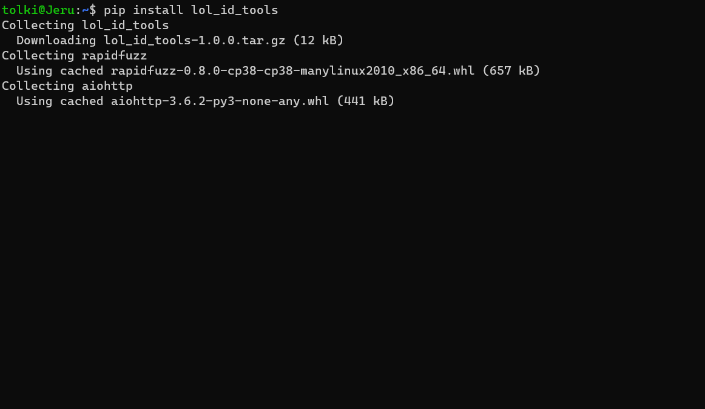

[](https://github.com/psf/black)


# lol_id_tools
An id tool for League of Legends with fuzzy string matching, nicknames, multiple locales, automatic updates, 
and translation.

The package relies on [rapidfuzz](https://github.com/rhasspy/rapidfuzz) for string matching.

This documentation pertains to version `1.0.0` and forward.

# Installation

Get lit with `pip install lol-id-tools`

# Demo


# Usage
## Import
```
import lol_id_tools as lit
```
## Get id from name
When the name is typed properly, matching takes 0.0004ms.
```
lit.get_id('Miss Fortune')
> 21
timeit('lit.get_id("miss fortune")', setup="import lol_id_tools as lit", number=1000)
> 0.0004502000000030648
```

Fuzzy string matching takes about 2ms.
```
lit.get_id('misfortune')
> 21
timeit('lit.get_id("misfortune")', setup="import lol_id_tools as lit", number=1000)
> 2.0069257
```

If the source locale for the name is not loaded, you can force load it with
```
lit.get_id('미스 포츈', locale='ko_KR')
> 21
```

The minimum_score parameter can be used to alter behaviour. 
```
lit.get_id('misfo')
lit.NoMatchingNameFound: No object name close enough to the input string found.

lit.get_id('misfo', minimum_score = 50)
> 21
```

All types of object can be matched by default.
```
lit.get_id('Maw of Malmortius')
> 3156
```

## Get name from ID
On patch 10.10 no champion, item, or rune shares an ID. If they do in the future, the package will need to be
updated accordingly.

```
lit.get_name(11)
> 'Master Yi'
```

If a locale needed for output is not loaded, it will automatically add it to the package.
```
lit.get_name(11, 'fr_FR')
> 'Maître Yi'
```

## Get translation
Default output is 'en_US'
```
lit.get_translation('미스 포츈')
> 'Miss Fortune'
```

If you haven’t loaded the input locale yet, you can supply it as a parameter
```
lit.get_translation('ミス・フォーチュン', 'zh_CN', input_locale='ja_JP')
> '赏金猎人'
```

If get_translation() is called on an existing locale, it returns the "clean" object name
```
lit.get_translation('Misfo', minimum_score = 50)
> 'Miss Fortune'
```

## Tests

You can take a look at the [tests suit](https://github.com/mrtolkien/lol_id_tools/tree/master/lol_id_tools/_tests) 
for more code examples.

## Notes

Data is saved in `~/.config/lol_id_tools` for offline usage and faster startup after first use. 
